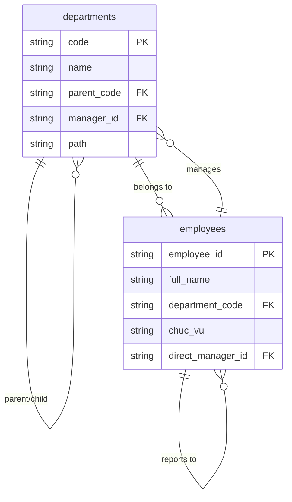

# Tài Liệu Thiết Kế: Hệ Thống Quản Lý Phòng Ban & Phân Quyền Đa Cấp

## 1. Thiết Kế Database (Cơ Sở Dữ Liệu)

Hiện tại hệ thống đang lưu `department` dạng chuỗi (text) trong bảng `employees`. Để hỗ trợ phân cấp cha-con (Phòng -> Xưởng -> Tổ), chúng ta cần chuẩn hóa dữ liệu này.

### 1.1. Bảng Mới: `departments`

Bảng này dùng để định nghĩa cây tổ chức.

```sql
CREATE TABLE departments (
  id SERIAL PRIMARY KEY,
  code VARCHAR(50) UNIQUE NOT NULL,      -- Mã phòng ban (VD: P_NS, X_MAY1, T_MAY1_1)
  name VARCHAR(100) NOT NULL,            -- Tên hiển thị
  parent_code VARCHAR(50),               -- Mã đơn vị cha (Self-reference)
  manager_id VARCHAR(50),                -- Employee ID của người đứng đầu (Trưởng phòng/Quản đốc/Tổ trưởng)
  level INTEGER DEFAULT 1,               -- Cấp độ (1: Khối/Phòng, 2: Xưởng, 3: Tổ)
  path TEXT,                             -- Materialized path để query nhanh (VD: /P_SX/X_MAY1/T_1)
  description TEXT,
  is_active BOOLEAN DEFAULT true,
  created_at TIMESTAMP DEFAULT CURRENT_TIMESTAMP,
  updated_at TIMESTAMP DEFAULT CURRENT_TIMESTAMP,

  -- Constraints
  FOREIGN KEY (parent_code) REFERENCES departments(code) ON DELETE SET NULL,
  FOREIGN KEY (manager_id) REFERENCES employees(employee_id) ON DELETE SET NULL
);

-- Index cho việc tìm kiếm cây con nhanh chóng
CREATE INDEX idx_departments_parent ON departments(parent_code);
CREATE INDEX idx_departments_path ON departments(path);
```

### 1.2. Cập Nhật Bảng: `employees`

Cần thêm các trường để xác định rõ ràng vai trò và quan hệ báo cáo.

```sql
-- Thêm các giá trị ENUM mới cho cột chuc_vu (nếu dùng check constraint)
ALTER TABLE employees DROP CONSTRAINT IF EXISTS employees_chuc_vu_check;
ALTER TABLE employees ADD CONSTRAINT employees_chuc_vu_check
  CHECK (chuc_vu IN ('admin', 'giam_doc', 'ke_toan', 'nguoi_lap_bieu', 'truong_phong', 'quan_doc', 'to_truong', 'nhan_vien', 'cong_nhan', 'van_phong'));

-- Thêm cột department_code để link chặt chẽ hơn (giai đoạn migration sẽ sync từ department name sang code)
ALTER TABLE employees ADD COLUMN IF NOT EXISTS department_code VARCHAR(50) REFERENCES departments(code);

-- Thêm cột manager_id để xác định người quản lý trực tiếp (cho báo cáo cấp dưới)
ALTER TABLE employees ADD COLUMN IF NOT EXISTS direct_manager_id VARCHAR(50) REFERENCES employees(employee_id);
```

### 1.3. Sơ Đồ Quan Hệ (Entity Relationship)



---

## 2. Thiết Kế API

### 2.1. Endpoints Quản Lý Phòng Ban (Admin)

| Method   | Path                            | Mô tả                                                   | Quyền hạn       |
| :------- | :------------------------------ | :------------------------------------------------------ | :-------------- |
| `GET`    | `/api/admin/departments`        | Lấy danh sách phòng ban (dạng phẳng hoặc cây)           | Admin, Giam_doc |
| `POST`   | `/api/admin/departments`        | Tạo phòng ban mới                                       | Admin           |
| `PUT`    | `/api/admin/departments/[code]` | Cập nhật thông tin (tên, trưởng đơn vị)                 | Admin           |
| `DELETE` | `/api/admin/departments/[code]` | Xóa phòng ban (check constraints nhân viên)             | Admin           |
| `POST`   | `/api/admin/departments/sync`   | Đồng bộ dữ liệu từ string `department` cũ sang bảng mới | Admin           |

### 2.2. Endpoints Dữ Liệu Phân Quyền (User)

**Logic quan trọng:** Các API này không nhận tham số `department` tùy ý, mà hệ thống tự `filter` dựa trên Token của người gọi.

| Method | Path                          | Mô tả                                         | Logic Phân Quyền                                 |
| :----- | :---------------------------- | :-------------------------------------------- | :----------------------------------------------- |
| `GET`  | `/api/hierarchical/employees` | Lấy DS nhân viên thuộc phạm vi quản lý        | Dựa trên `path` của phòng ban người dùng quản lý |
| `GET`  | `/api/hierarchical/payroll`   | Lấy bảng lương thuộc phạm vi quản lý          | Join với bảng departments để lấy cây con         |
| `GET`  | `/api/hierarchical/my-scope`  | Trả về thông tin user đang quản lý đơn vị nào | Trả về node hiện tại và danh sách sub-nodes      |

### 2.3. Logic Phân Quyền API Chi Tiết (Pseudo-code)

```typescript
// Hàm lấy danh sách phòng ban được phép truy cập
async function getAccessibleDepartments(user: User): Promise<string[]> {
  const db = createClient();

  // 1. Cấp Toàn Công Ty
  if (["giam_doc", "ke_toan", "nguoi_lap_bieu", "admin"].includes(user.role)) {
    return ["ALL"];
  }

  // 2. Tìm phòng ban user đang làm trưởng (dựa trên bảng departments hoặc department_permissions)
  let rootDepts = [];

  // Case A: Định nghĩa trong bảng departments (người đứng đầu chính danh)
  const { data: managed } = await db
    .from("departments")
    .select("code")
    .eq("manager_id", user.employee_id);
  rootDepts.push(...managed.map((d) => d.code));

  // Case B: Quyền bổ sung từ bảng department_permissions (quyền kiêm nhiệm)
  const { data: granted } = await db
    .from("department_permissions")
    .select("department_code")
    .eq("employee_id", user.employee_id);
  rootDepts.push(...granted.map((d) => d.department_code));

  if (rootDepts.length === 0) return [];

  // 3. Lấy tất cả phòng ban con (Recursive)
  // Query dựa trên 'path' (VD: path LIKE '/P_SX%')
  const { data: allDepts } = await db.rpc(
    "get_recursive_downstream_departments",
    { root_codes: rootDepts },
  );

  return allDepts.map((d) => d.code);
}
```

---

## 3. Thiết Kế Frontend

### 3.1. Cấu Trúc Trang Quản Lý (`/admin/department-management`)

Trang này dành cho Admin thiết lập cây tổ chức.

- **Layout:** Two-column layout (Left: Tree View, Right: Details/Edit Form).
- **Components:**
  1.  `DepartmentTree`: Hiển thị cấu trúc phân cấp (sử dụng thư viện như `react-d3-tree` hoặc đệ quy component đơn giản).
  2.  `DepartmentEditor`: Form thêm/sửa phòng ban (chọn Parent, chọn Manager từ dropdown search employee).
  3.  `StaffList`: Tab phụ bên phải hiển thị danh sách nhân viên thuộc phòng ban đang chọn.

### 3.2. Cấu Trúc Dashboard Phân Quyền

Cần cập nhật `RoleBasedRouter` để điều hướng user đến đúng view:

- **View Giám Đốc (`/director`)**: Dashboard tổng hợp toàn công ty. Biểu đồ theo Khối.
- **View Trưởng Phòng (`/manager`)**:
  - Thấy danh sách các **Quản Đốc** và **Tổ Trưởng** trực thuộc.
  - Drill-down: Click vào Xưởng A -> Xem chi tiết Xưởng A.
- **View Quản Đốc (`/workshop-manager`) - MỚI**:
  - Thấy danh sách **Tổ Trưởng** và Công nhân trực thuộc.
  - Phạm vi: Chỉ thấy dữ liệu trong Xưởng mình.
- **View Tổ Trưởng (`/supervisor`)**:
  - Giữ nguyên, chỉ thấy nhân viên trong tổ.

### 3.3. Wireframe Component Cây (DepartmentTree)

```
+---------------------------------------------------------+
| [Search Department...]             [+ Thêm Phòng Ban]   |
+---------------------------------------------------------+
| > 🏢 Ban Giám Đốc                                       |
| v 🏭 Khối Sản Xuất (Trưởng: Ông A)  [Edit] [Delete]     |
|     > 🛠️ Xưởng May 1 (Q.Đốc: Bà B)                     |
|         - 🧵 Tổ May 1 (T.Trưởng: Cô C)                  |
|         - 🧵 Tổ May 2 (T.Trưởng: Cô D)                  |
|     > 🛠️ Xưởng Cắt                                     |
| > 💼 Khối Văn Phòng                                     |
+---------------------------------------------------------+
```

---

## 4. Logic Phân Quyền & RLS (Bảo Mật)

### 4.1. Ma Trận Phân Quyền (Permission Matrix)

| Role             | `view_all_depts` | `view_own_dept_tree` | `view_salary_all` | `view_salary_tree` | `approve_payroll`  |
| :--------------- | :--------------: | :------------------: | :---------------: | :----------------: | :----------------: |
| **Giam_doc**     |        ✅        |          ✅          |        ✅         |         ✅         |         ✅         |
| **Ke_toan**      |        ✅        |          ✅          |        ✅         |         ✅         |         ❌         |
| **Truong_phong** |        ❌        |     ✅ (Level 1)     |        ❌         |  ✅ (Downstream)   |   ✅ (Dept only)   |
| **Quan_doc**     |        ❌        |     ✅ (Level 2)     |        ❌         |  ✅ (Downstream)   | ✅ (Workshop only) |
| **To_truong**    |        ❌        |     ✅ (Level 3)     |        ❌         |   ✅ (Team only)   |         ❌         |
| **Nhan_vien**    |        ❌        |          ❌          |        ❌         |   ❌ (Own only)    |         ❌         |

### 4.2. Database RLS Policy (PostgreSQL)

Chúng ta cần tạo một function Database `get_accessible_department_codes()` để dùng trong RLS policies cho gọn.

```sql
-- Function trả về list department codes mà user hiện tại được phép xem
CREATE OR REPLACE FUNCTION get_accessible_department_codes()
RETURNS TABLE (code VARCHAR) SECURITY DEFINER AS $$
DECLARE
  curr_user_role VARCHAR;
  curr_employee_id VARCHAR;
BEGIN
  -- Lấy role và id từ JWT
  curr_user_role := auth.jwt() ->> 'role';
  curr_employee_id := auth.jwt() ->> 'employee_id';

  -- 1. Admin/GD/KeToan: Xem hết
  IF curr_user_role IN ('admin', 'giam_doc', 'ke_toan', 'nguoi_lap_bieu') THEN
    RETURN QUERY SELECT d.code FROM departments d;
    RETURN;
  END IF;

  -- 2. Các cấp quản lý: Dùng CTE đệ quy để lấy cây con
  RETURN QUERY
  WITH RECURSIVE dept_tree AS (
    -- Anchor: Các phòng ban user quản lý trực tiếp
    SELECT d.code, d.path
    FROM departments d
    WHERE d.manager_id = curr_employee_id
       OR d.code IN (SELECT department_code FROM department_permissions WHERE employee_id = curr_employee_id)

    UNION ALL

    -- Recursive: Lấy các phòng ban con
    SELECT child.code, child.path
    FROM departments child
    JOIN dept_tree parent ON child.parent_code = parent.code
  )
  SELECT code FROM dept_tree;
END;
$$ LANGUAGE plpgsql;

-- Áp dụng vào Policy xem lương
CREATE POLICY "view_payroll_hierarchy" ON payrolls
FOR SELECT USING (
  -- User xem lương của chính mình
  employee_id = (auth.jwt() ->> 'employee_id')
  OR
  -- Hoặc xem lương nhân viên thuộc phòng ban mình quản lý
  EXISTS (
    SELECT 1 FROM employees e
    WHERE e.employee_id = payrolls.employee_id
    AND e.department_code IN (SELECT code FROM get_accessible_department_codes())
  )
);
```

---

## 5. Các Bước Triển Khai (Implementation Plan)

### Phase 1: Database & Backend Foundation (Ước lượng: 1-2 ngày)

1.  Tạo bảng `departments` và migration script chuyển dữ liệu từ `employees.department` sang bảng mới.
2.  Cập nhật Enum types cho Role (`quan_doc`, `cong_nhan`).
3.  Viết PostgreSQL Functions cho đệ quy (Recursive query).
4.  Cập nhật file `lib/auth.ts` để support logic permission mới.

### Phase 2: Admin Management UI (Ước lượng: 1 ngày)

1.  Tạo trang `/admin/department-management`.
2.  Implement API CRUD department.
3.  Tạo UI Tree View cho phép kéo thả hoặc chọn parent để cấu trúc lại phòng ban.

### Phase 3: Dashboard & Hierarchical Views (Ước lượng: 2 ngày)

1.  Refactor `ManagerDashboard` để hỗ trợ view "Đệ quy" (Xem tổng hợp số liệu của cả các xưởng con).
2.  Tạo mới `WorkshopManagerDashboard` (Dashboard Quản đốc) - clone từ Manager nhưng scope nhỏ hơn.
3.  Update API `payroll/my-departments` để sử dụng logic đệ quy thay vì string matching đơn thuần.

### Phase 4: Data Migration & Testing (Ước lượng: 1 ngày)

1.  Script map các string department hiện tại (ví dụ: "Tổ May 1 - Xưởng 2") vào cấu trúc cha con chuẩn.
2.  Test kỹ phân quyền 6 cấp với các account test.
