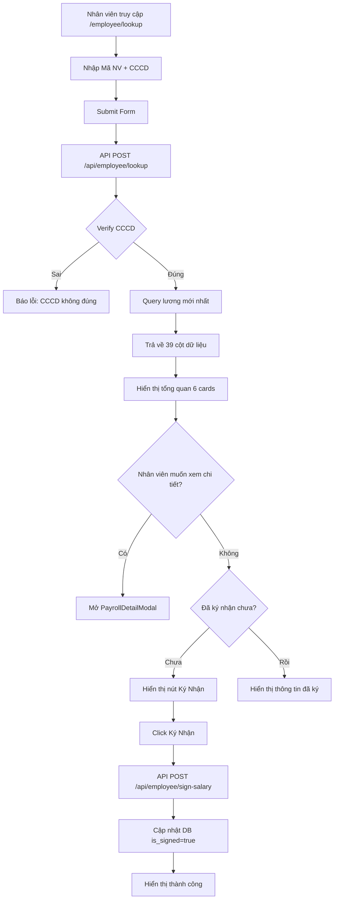

# Phân Tích Hệ Thống Tra Cứu Lương Nhân Viên

## Tổng Quan

Hệ thống cho phép nhân viên tra cứu thông tin lương chi tiết của mình bằng cách nhập mã nhân viên và số CCCD. Hệ thống đảm bảo bảo mật thông tin và cho phép nhân viên ký xác nhận đã nhận thông tin lương.

## Kiến Trúc Hệ Thống

### 1. Frontend - Giao Diện Người Dùng

#### 1.1 Trang Tra Cứu (`app/employee/lookup/page.tsx`)

- **URL**: `/employee/lookup`
- **Tiêu đề**: "Tra Cứu Lương & Ký Xác Nhận Lương - CÔNG TY MAY HÒA THỌ ĐIỆN BÀN"
- **Component chính**: `<EmployeeLookup />`

#### 1.2 Component EmployeeLookup (`app/employee/lookup/employee-lookup.tsx`)

**Chức năng chính:**

- Form nhập liệu với 2 trường:
  - **Mã nhân viên**:
    - Nhân viên chính thức: `DB0` + mã số (VD: DB01234)
    - Nhân viên thử việc: `DBT0` + mã số (VD: DBT01234)
  - **Số CCCD**: Hiển thị dạng password, có nút ẩn/hiện

**State quản lý:**

```typescript
- employeeId: string          // Mã nhân viên
- cccd: string               // Số CCCD
- showCccd: boolean          // Ẩn/hiện CCCD
- loading: boolean           // Trạng thái loading
- result: PayrollResult      // Kết quả tra cứu
- error: string              // Thông báo lỗi
- signingLoading: boolean    // Đang ký nhận
- signSuccess: boolean       // Ký thành công
- showDetailModal: boolean   // Hiện modal chi tiết
```

### 2. Backend - API Routes

#### 2.1 API Tra Cứu Lương (`app/api/employee/lookup/route.ts`)

**Endpoint**: `POST /api/employee/lookup`

**Request Body:**

```json
{
  "employee_id": "DB01234",
  "cccd": "123456789012"
}
```

**Quy trình xử lý:**

1. **Xác thực nhân viên:**

   ```typescript
   // Tìm nhân viên trong database
   const { data: employee } = await supabase
     .from("employees")
     .select("employee_id, full_name, cccd_hash, department, chuc_vu")
     .eq("employee_id", employee_id.trim())
     .single();
   ```

2. **Verify CCCD:**

   ```typescript
   // So sánh CCCD với hash đã lưu
   const isValidCCCD = await bcrypt.compare(cccd.trim(), employee.cccd_hash);
   ```

3. **Lấy dữ liệu lương mới nhất:**

   ```typescript
   const { data: payroll } = await supabase
     .from("payrolls")
     .select("*")
     .eq("employee_id", employee_id.trim())
     .order("created_at", { ascending: false })
     .limit(1)
     .single();
   ```

4. **Trả về dữ liệu:**
   Response bao gồm đầy đủ 39 cột dữ liệu lương + thông tin ký nhận

#### 2.2 API Ký Nhận Lương (`app/api/employee/sign-salary/route.ts`)

**Endpoint**: `POST /api/employee/sign-salary`

**Chức năng:**

- Xác nhận lại CCCD
- Ghi nhận thông tin ký: thời gian, IP, thiết bị
- Cập nhật trạng thái `is_signed = true` trong database

### 3. Database Schema

#### 3.1 Bảng `employees`

```sql
CREATE TABLE employees (
  id SERIAL PRIMARY KEY,
  employee_id VARCHAR(50) UNIQUE NOT NULL,     -- Mã nhân viên
  full_name VARCHAR(255) NOT NULL,             -- Họ tên
  cccd_hash VARCHAR(255) NOT NULL,             -- CCCD đã hash
  department VARCHAR(100) NOT NULL,            -- Phòng ban
  chuc_vu VARCHAR(50) NOT NULL,               -- Chức vụ
  -- ...
);
```

#### 3.2 Bảng `payrolls`

```sql
CREATE TABLE payrolls (
  -- Metadata
  id SERIAL PRIMARY KEY,
  employee_id VARCHAR(50) NOT NULL,
  salary_month VARCHAR(20) NOT NULL,           -- "2024-07"

  -- Thông tin ký
  is_signed BOOLEAN DEFAULT false,
  signed_at TIMESTAMP NULL,
  signed_by_name VARCHAR(255) NULL,

  -- 39 cột dữ liệu lương
  he_so_lam_viec DECIMAL(5,2),
  he_so_phu_cap_ket_qua DECIMAL(5,2),
  -- ... 37 cột khác
  tien_luong_thuc_nhan_cuoi_ky DECIMAL(15,2), -- Lương thực nhận

  FOREIGN KEY (employee_id) REFERENCES employees(employee_id)
);
```

### 4. Hiển Thị Dữ Liệu

#### 4.1 Hiển Thị Tổng Quan

Sau khi tra cứu thành công, hiển thị:

**Thông tin cá nhân:**

- Họ tên, Mã NV
- Chức vụ, Phòng ban
- Tháng lương

**6 Card thông tin quan trọng:**

1. **Hệ Số Làm Việc** (màu xanh dương)
2. **Hệ Số Phụ Cấp KQ** (màu xanh lá)
3. **Tiền Khen Thưởng Chuyên Cần** (màu tím)
4. **Lương Học Việc PC** (màu cam)
5. **BHXH BHTN BHYT** (màu đỏ - khấu trừ)
6. **Lương Thực Nhận Cuối Kỳ** (màu xanh ngọc - số tiền cuối cùng)

#### 4.2 Modal Chi Tiết (`payroll-detail-modal.tsx`)

Khi click "Xem Chi Tiết Đầy Đủ", hiển thị modal với 8 nhóm thông tin:

1. **Hệ Số và Thông Số Cơ Bản** (4 chỉ số)
   - Hệ Số Làm Việc
   - Hệ Số Phụ Cấp Kết Quả
   - Hệ Số Lương Cơ Bản
   - Lương Tối Thiểu Công Ty

2. **Thời Gian Làm Việc** (5 chỉ số)
   - Ngày Công Trong Giờ
   - Giờ Công Tăng Ca
   - Giờ Ăn Ca
   - Tổng Giờ Làm Việc
   - Tổng Hệ Số Quy Đổi

3. **Lương Sản Phẩm và Đơn Giá** (5 chỉ số)
   - Tổng Lương Sản Phẩm Công Đoạn
   - Đơn Giá Tiền Lương Trên Giờ
   - Tiền Lương Sản Phẩm Trong Giờ
   - Tiền Lương Tăng Ca
   - Tiền Lương 30p Ăn Ca

4. **Thưởng và Phụ Cấp** (5 chỉ số)
   - Tiền Khen Thưởng Chuyên Cần
   - Lương Học Việc PC Lương
   - Tổng Cộng Tiền Lương Sản Phẩm
   - Hỗ Trợ Thời Tiết Nóng
   - Bổ Sung Lương

5. **Bảo Hiểm và Phúc Lợi** (5 chỉ số)
   - BHXH 21.5%
   - PC CDCS PCCC ATVSV
   - Lương Phụ Nữ Hành Kinh
   - Tiền Con Bú Thai 7 Tháng
   - Hỗ Trợ Gửi Con Nhà Trẻ

6. **Phép và Lễ** (2 chỉ số)
   - Ngày Công Phép Lễ
   - Tiền Phép Lễ

7. **Tổng Lương và Phụ Cấp Khác** (3 chỉ số)
   - Tổng Cộng Tiền Lương
   - Tiền Bốc Vác
   - Hỗ Trợ Xăng Xe

8. **Thuế và Khấu Trừ** (5 chỉ số)
   - Thuế TNCN Năm 2024
   - Tạm Ứng
   - Thuế TNCN
   - BHXH BHTN BHYT Total
   - Truy Thu Thẻ BHYT

**Kết quả cuối cùng:**

- **Tiền Lương Thực Nhận Cuối Kỳ** (highlighted trong card màu xanh lá)

### 5. Tính Năng Ký Nhận Lương

#### 5.1 Trạng Thái Ký

- **Chưa ký**: Hiển thị nút "Ký Nhận Lương" màu xanh lá
- **Đã ký**: Hiển thị thông tin:
  - Người ký (tên nhân viên)
  - Thời gian ký (format: dd/mm/yyyy HH:mm:ss)
  - Badge "Đã ký" màu xanh

#### 5.2 Quy Trình Ký

1. Nhân viên click nút "Ký Nhận Lương"
2. Hệ thống gọi API `/api/employee/sign-salary`
3. Xác thực lại CCCD
4. Ghi nhận thông tin ký vào database
5. Cập nhật giao diện với trạng thái mới

### 6. Bảo Mật

1. **CCCD được hash**: Sử dụng bcrypt để hash CCCD trước khi lưu
2. **Input dạng password**: CCCD được ẩn khi nhập
3. **Xác thực 2 lớp**: Kiểm tra cả mã NV và CCCD
4. **Service Role Key**: Sử dụng riêng cho API routes
5. **RLS Policies**: Áp dụng Row Level Security trong Supabase

### 7. Utilities và Helpers

#### 7.1 Format Functions (`lib/utils/date-formatter.ts`)

- `formatCurrency()`: Format tiền VND (VD: 5.000.000 ₫)
- `formatNumber()`: Format số với dấu phân cách hàng nghìn
- `formatSalaryMonth()`: Format tháng lương (VD: "Tháng 7/2024")
- `formatSignatureTime()`: Format thời gian ký

#### 7.2 Supabase Client (`utils/supabase/server.ts`)

- `createClient()`: Client thông thường
- `createServiceClient()`: Client với Service Role Key cho API

### 8. Luồng Hoạt Động Tổng Thể



## Kết Luận

Hệ thống tra cứu lương được thiết kế với các ưu điểm:

1. **Bảo mật cao**: CCCD được hash, xác thực 2 lớp
2. **Trải nghiệm người dùng tốt**: Giao diện rõ ràng, responsive
3. **Đầy đủ thông tin**: Hiển thị toàn bộ 39 cột dữ liệu lương
4. **Tính năng ký số**: Cho phép xác nhận đã nhận thông tin
5. **Kiến trúc clean**: Tách biệt frontend/backend, sử dụng TypeScript

Hệ thống phù hợp cho doanh nghiệp vừa và lớn cần quản lý lương minh bạch và chuyên nghiệp.
