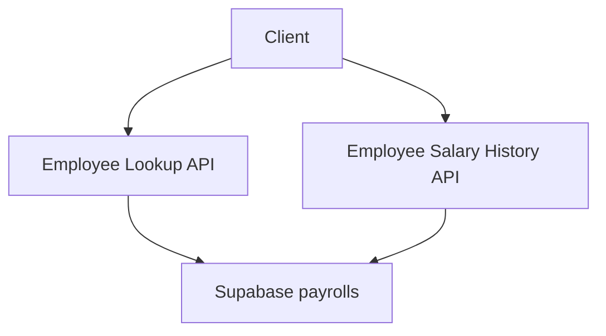

# Ke hoach toi uu hoa API tra cuu luong - Tach select columns theo loai luong

## Overview

Muc tieu la giam payload tra ve tu bang payrolls bang cach thay the [`select()`](app/api/employee/lookup/route.ts:62) `*` bang tap cot toi thieu theo loai luong. Pham vi ap dung: hai API [`app/api/employee/lookup/route.ts`](app/api/employee/lookup/route.ts) va [`app/api/employee/salary-history/route.ts`](app/api/employee/salary-history/route.ts). Constants duoc dat tai [`lib/payroll-select.ts`](lib/payroll-select.ts:1) va chi dung cho hai API tren.

## Options

1. **Constants chuoi select trong [`lib/payroll-select.ts`](lib/payroll-select.ts:1)**
   - Uu: tap trung, tai su dung, de doi chieu danh sach cot; khong doi API contract.
   - Nhuoc: can tao file moi va import trong 2 API.
2. **Inline select string ngay trong tung API**
   - Uu: it tao file moi, thay doi nho.
   - Nhuoc: duplicate danh sach cot, kho bao tri, de lech giua 2 API.
3. **Tao view hoac RPC tu DB**
   - Uu: toi uu tu DB, co the tai su dung nhieu noi.
   - Nhuoc: can migration va sua RLS; ngoai pham vi toi uu nhanh, tang rui ro rollout.

**Khuyen nghi:** Chon Option 1 vi can bang giua hieu qua va rui ro, phu hop pham vi hien tai.

## Architecture

- Client goi API.
- API chon tap cot theo `is_t13` va tra ve payload toi thieu.
- Supabase RLS giu nguyen, chi giam so cot tra ve.

## Data flow

1. Client gui `is_t13` va tham so truy van.
2. API chon chuoi select phu hop.
3. Supabase tra ve payroll theo tap cot.
4. API hop nhat vao response hien co.

## API contracts

- Khong thay doi input va shape response.
- Thay doi o query select, da duoc dinh vi tai [`app/api/employee/lookup/route.ts`](app/api/employee/lookup/route.ts:19) va [`app/api/employee/salary-history/route.ts`](app/api/employee/salary-history/route.ts:9).

## Data model

Khong thay doi schema. Chi thay doi tap cot duoc chon tu bang payrolls.

## Security

- Tiep tuc dung service client; RLS khong doi.
- Khong thay doi logic auth, chi giam payload.

## Observability

- Log hay metric khong bat buoc.
- Co the them do do payload o phia client neu can, ngoai pham vi hien tai.

## Rollout and Migration

- Khong can migration.
- Rollout cung dot, de rollback bang cach tra ve [`select()`](app/api/employee/lookup/route.ts:62) `*` neu can.

## Testing

De xuat test cases:

1. Lookup luong thang thuong tra ve day du cot monthly, khong co cac cot T13.
2. Lookup luong T13 tra ve day du cot T13, khong co cac cot monthly.
3. Salary history `get_payroll` thang thuong va T13 hoat dong nhu truoc.
4. Truong hop `payroll_type` null van duoc chon dung trong monthly.
5. Response van giu cac field core: id, employee_id, salary_month, payroll_type, source_file, is_signed, signed_at, signed_by_name.

## Risks and open questions

- Neu client dang dung mot so cot monthly hoac T13 ngoai danh sach, can bo sung vao select.
- Can dong bo danh sach cot voi UI quan ly neu reuse.

## Dinh nghia constants

Dat tai [`lib/payroll-select.ts`](lib/payroll-select.ts:1) dang chuoi select.

- [`const PAYROLL_SELECT_CORE`](lib/payroll-select.ts:1): id, employee_id, salary_month, payroll_type, source_file, is_signed, signed_at, signed_by_name
- [`const PAYROLL_SELECT_T13`](lib/payroll-select.ts:10): PAYROLL_SELECT_CORE + 17 cot T13
- [`const PAYROLL_SELECT_MONTHLY`](lib/payroll-select.ts:20): PAYROLL_SELECT_CORE + 40 cot monthly

## Thay doi cho tung API

- [`app/api/employee/lookup/route.ts`](app/api/employee/lookup/route.ts:1)
  - Doi [`select()`](app/api/employee/lookup/route.ts:62) `*` sang PAYROLL_SELECT_T13 hoac PAYROLL_SELECT_MONTHLY dua tren `is_t13`.
- [`app/api/employee/salary-history/route.ts`](app/api/employee/salary-history/route.ts:1)
  - Doi [`select()`](app/api/employee/salary-history/route.ts:95) `*` sang PAYROLL_SELECT_T13 hoac PAYROLL_SELECT_MONTHLY trong nhanh `get_payroll`.

## Uoc tinh impact

Gia su tong cot payrolls = 65 (core 8 + monthly 40 + T13 17).

- Tra cuu monthly: giam ~26.2 phan tram payload do bo 17 cot T13.
- Tra cuu T13: giam ~61.5 phan tram payload do bo 40 cot monthly.

## Implementation plan

- [ ] Xac nhan danh sach cot core, monthly, T13 trong [`lib/payroll-select.ts`](lib/payroll-select.ts:1) va can doi chieu voi UI (Code mode).
- [ ] Tao file constants [`lib/payroll-select.ts`](lib/payroll-select.ts:1) theo format chuoi select (Code mode).
- [ ] Cap nhat [`app/api/employee/lookup/route.ts`](app/api/employee/lookup/route.ts:1) su dung constants (Code mode).
- [ ] Cap nhat [`app/api/employee/salary-history/route.ts`](app/api/employee/salary-history/route.ts:1) su dung constants (Code mode).
- [ ] Chay test de xac nhan response va payload (Code mode).
