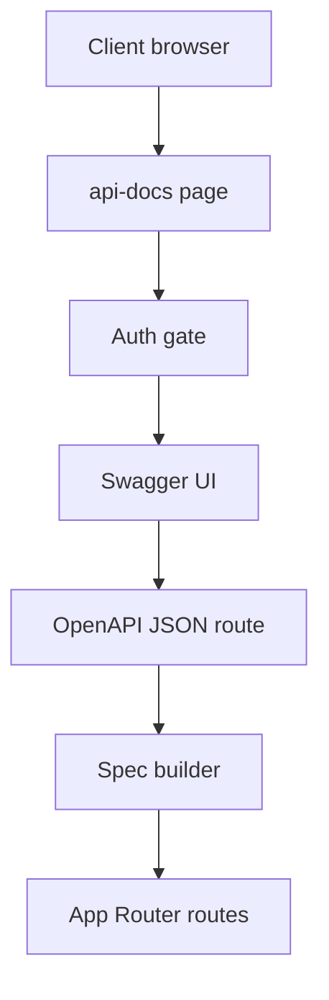

# Thiet ke trang tai lieu REST API /api-docs

## Overview

Muc tieu la bo sung trang tai lieu REST API noi bo cho du an, hien thi Swagger UI tai duong dan /api-docs. Tai lieu duoc tao tu dong tu JSDoc/annotation tren cac endpoint trong App Router, tuong thich Vercel (khong ghi filesystem), bao phu toan bo endpoint, va chi cho phep truy cap bang session/cookie admin voi vai tro giam_doc, ke_toan, nguoi_lap_bieu, admin.

## Options va trade-offs

### Option A: swagger-jsdoc + swagger-ui-react (runtime)

- Mo ta: Tao route tra ve OpenAPI JSON bang swagger-jsdoc quet JSDoc, Swagger UI render trong trang /api-docs.
- Uu diem: Hoat dong tot trong App Router, khong can ghi file, linh hoat cau hinh.
- Nhuoc diem: Can viet JSDoc day du, phai tu cai dat tagging va security scheme.

### Option B: next-swagger-doc + swagger-ui-react

- Mo ta: Dung next-swagger-doc tu dong sinh spec cho Next.js, render UI tren /api-docs.
- Uu diem: Cau hinh nhanh, giam boilerplate.
- Nhuoc diem: Ho tro App Router co the han che, can kiem tra tuong thich voi Vercel runtime.

### Option C: Script tao spec rieng + UI tieu chuan

- Mo ta: Viet script tao spec tu annotation, build-time tao JSON, UI doc doc file.
- Uu diem: Spec on dinh, it tai runtime.
- Nhuoc diem: Khong phu hop Vercel neu can ghi file, kho cap nhat dong.

## Recommended approach

Chon Option A: swagger-jsdoc + swagger-ui-react. Ly do: phu hop App Router, tao spec runtime khong can ghi filesystem, de kiem soat auth va cach tag theo folder /admin /employee /payroll /debug.

## Architecture

- Trang /api-docs la UI (App Router page) chi cho phep admin duoc phep truy cap.
- Route JSON: /api-docs/openapi (hoac /api-docs/openapi.json) tao spec runtime tu JSDoc.
- Swagger UI fetch JSON tu route tren.
- Auth check ca o page va o JSON route de tranh lo thong tin.

## Data flow

1. Nguoi dung truy cap /api-docs.
2. Middleware hoac page server check session/cookie admin va role.
3. Neu hop le, UI load va goi /api-docs/openapi.
4. Route OpenAPI tao spec runtime tu JSDoc trong app/api/\*\*/route.ts.
5. UI render danh sach endpoint theo tag /admin /employee /payroll /debug.

## API contracts

- OpenAPI 3.0.x
- Security scheme: cookie-based session
- Response schema chung:
  - ErrorResponse: { code, message, details? }
  - Pagination: { page, pageSize, total }
- File upload: multipart/form-data
- Rate limit: neu co, dua vao response header

## Data model

Khong them bang moi. Chi can schema logic phuc vu tai lieu:

- Auth session cookie
- Role enum: admin, giam_doc, ke_toan, nguoi_lap_bieu, truong_phong, to_truong, van_phong, nhan_vien

## Security

- Chi cho phep role giam_doc, ke_toan, nguoi_lap_bieu, admin.
- No-store cache cho /api-docs va /api-docs/openapi.
- Log truy cap vao /api-docs.
- Khong expose endpoint noi bo neu co (co the tag va hide neu can).

## Observability

- Log so luong request toi /api-docs va /api-docs/openapi.
- Log loi khi tao OpenAPI spec.
- Theo doi thoi gian tao spec (p95) de toi uu.

## Rollout / Migration

- Buoc 1: Them infra tao spec + UI va auth gate.
- Buoc 2: Viet JSDoc cho cac nhom endpoint theo tag.
- Buoc 3: Phat hanh noi bo, thu thap feedback.
- Buoc 4: Mo rong hoan thien cac schema va example.

## Testing

- Unit test: auth gate cho /api-docs va /api-docs/openapi.
- Contract test: openapi.json validate schema.
- Snapshot test: tag/grouping dung theo folder.

## Risks & open questions

- Do phu JSDoc: can quy uoc dang comment de dong bo.
- Thoi gian tao spec khi co nhieu endpoint.
- Cach xu ly endpoint debug: co an/hien tuy moi truong?

## Implementation plan (checklist)

- [ ] Chon thu vien tao OpenAPI runtime tu JSDoc (swagger-jsdoc hoac next-swagger-doc) phu hop App Router va Vercel
- [ ] Thiet ke route JSON /api-docs/openapi va co che cache trong bo nho
- [ ] Tao page /api-docs voi Swagger UI
- [ ] Tich hop auth gate dua tren session/cookie admin va role
- [ ] Dinh nghia schema chung (ErrorResponse, Pagination, Upload)
- [ ] Viet JSDoc cho toan bo endpoint theo tag folder
- [ ] Bo sung log va metric co ban cho access va spec generation
- [ ] Test auth va validation cua OpenAPI

## Hand off to Code mode

- Implement UI /api-docs va JSON route
- Them JSDoc cho cac endpoint
- Them auth gate va logging
